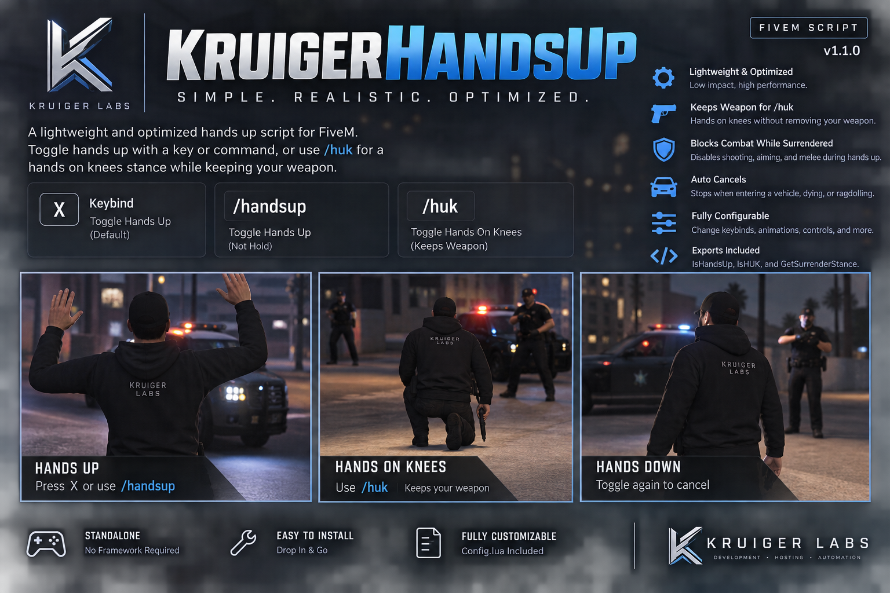

# KruigerHandsUp v1.1.0

A lightweight standalone surrender-animation resource for FiveM by Kruiger Labs LLC.

## Features

- **X** toggles hands up/down
- `/handsup` toggles hands up/down
- `/huk` toggles the hands-on-knees/kneeling stance
- `/huk` keeps the player's currently selected weapon rather than forcibly removing or switching it
- Switching between `/handsup` and `/huk` automatically stops the previous stance
- Standalone; no framework dependency
- Cancels the stance when dead, ragdolling, or entering a vehicle
- Blocks attacking, aiming, reloading, melee, and the weapon wheel while surrendering
- Configurable animations and controls
- Client exports for integrations

## Installation

Place `KruigerHandsUp` in your resources folder and add:

```cfg
ensure KruigerHandsUp
```

## Commands

```text
/handsup
/huk
```

## Exports

```lua
local handsUp = exports['KruigerHandsUp']:IsHandsUp()
local huk = exports['KruigerHandsUp']:IsHUK()
local stance = exports['KruigerHandsUp']:GetSurrenderStance()
```

`stance` returns `handsup`, `huk`, or `nil`.

## Configuration

Edit `config.lua` to change the hands-up key, commands, animations, animation flags, or disabled controls.
